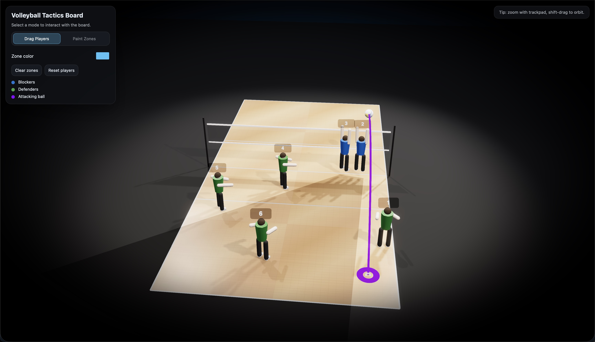

# Volleyball Tactics Board 🏐

A high-performance, 3D interactive tactics board for volleyball coaches and players. Developed with Three.js, it features realistic player models, dynamic block shadows, and arced attack trajectories.

**[View Live Demo](https://roenbaeck.github.io/volleyballer/)**

## Features

- **3D Interactive Board**: Smooth navigation with orbit controls (Zoom, Rotate, Pan).
- **Realistic Player Models**: 3D characters with adjustable heights (1.60m to 2.20m) and anatomically correct proportions.
- **Roster & Tactical Management**: Save and load custom lineups and player positions.
- **Team Rotation Tool**: One-click clockwise rotation for tactical drill planning.
- **Shareable Layouts**: Generate encoded URLs to share specific tactical setups.
- **Enhanced Player Attributes**: 
  - **Height**: Adjustable (1.60m to 2.20m).
  - **Block Reach**: Set individual vertical jump potential; blockers will "jump" higher based on their reach attribute.
- **Adaptive Player Stances**: 
  - **Blockers (Blue)**: Automatically switch to a blocking stance (arms up, jumping) when near the net.
  - **Defenders (Green)**: Switch to a crouched defensive stance when moving to the back court.
- **Dynamic Block Shadows**: Physically accurate shadow "wedges" that adapt to the ball's position. Multiple blockers close together automatically form a unified tactical wedge.
- **Net Dead-Zone Shadow**: Visualizes the area of the court that is unreachable by straight-line hits due to the net's height. This "shadow" dynamically updates based on the ball's distance from the net, its contact height, and the set **Attack Power** (lower power simulates a steeper arc, reducing the dead zone).
- **Advanced Attack Simulation**: Realistic parabolic ball flight paths with adjustable contact height and attack power.
- **Tactical Painting**: Draw custom zones on the court with adjustable colors.
- **Editable Labels**: Mark player roles (S, OH, MB, etc.) with dynamic sprite labels.

## How to Use

- **Rotate Camera**: Right-click/Shift + Drag.
- **Zoom**: Scroll wheel / Trackpad pinch.
- **Move Players/Ball**: Simply drag them across the court.
- **Select Player**: Click a player to open the roster editor (change role or height).
- **Save/Load**: Use the management panels to store lineups (player names/roles) and positions (tactical setups).
- **Paint Mode**: Toggle the switch to "Paint Zones" and drag on the floor to visualize field coverage.

## Technologies

- [Three.js](https://threejs.org/) (WebGL)
- [EffectComposer](https://threejs.org/docs/#examples/en/postprocessing/EffectComposer) (Bloom, SMAA, Vignette)
- HTML5 / CSS3 / JavaScript (ES6)
- LocalStorage (Persistence)
- Base64 Serialization (URL Sharing)

