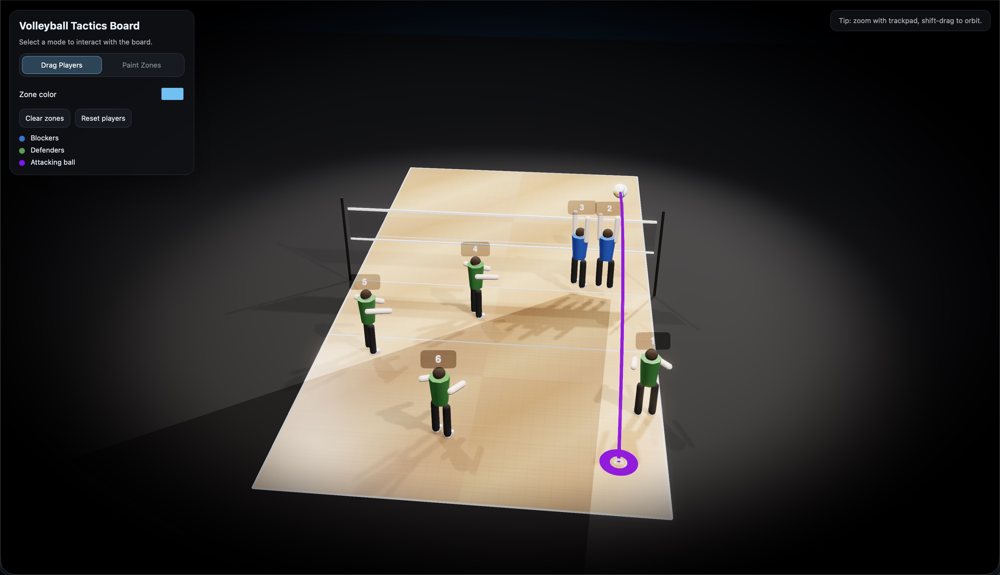

# Volleyball Tactics Board 🏐

A high-performance, 3D interactive tactics board for volleyball coaches and players. Developed with Three.js, it features articulated player models, physically modeled attack trajectories, dynamic tactical shadows, and a focused presentation environment.

**[View Live Demo](https://roenbaeck.github.io/volleyballer/)**



## Features

- **3D Interactive Board**: Smooth navigation with orbit controls (Zoom and Rotate).
- **Detailed Articulated Players**: Project-local glTF characters with animated block/defend stance clips, varied skin/hair tones, uniform trim, facial detail, knee pads, shoe accents, adjustable heights, and animated breathing. A procedural model remains as a graceful loading fallback.
- **Focused High-Fidelity Court**: Authored maple albedo/height/roughness textures, PBR materials, image-based lighting, GTAO contact shading, extended tactical projections, and a soft black court-edge falloff without distracting arena dressing.
- **Roster & Tactical Management**: Save and load custom lineups and player positions.
- **Team Rotation Tool**: One-click clockwise rotation for tactical drill planning.
- **Shareable Layouts**: Generate encoded URLs to share specific tactical setups.
- **Enhanced Player Attributes**: 
  - **Height**: Adjustable (1.60m to 2.20m).
  - **Block Reach**: Set individual vertical jump potential; blockers will "jump" higher based on their reach attribute.
- **Adaptive Player Stances**: 
  - **Blockers (Blue)**: Automatically switch to a blocking stance (arms up, jumping) when near the net.
  - **Defenders (Green)**: Switch to a crouched defensive stance when moving to the back court.
- **Dynamic Block Shadows**: Colored tactical wedges adapt to the ball's position and individual block reach. Multiple nearby blockers can form a unified wedge.
- **Net Dead-Zone Shadow**: Samples gravity-based trajectories across the receiving court to visualize targets blocked by the selected net height.
- **Projectile Attack Simulation**: Attack power controls horizontal velocity; vertical velocity is solved so the ball reaches the selected target under gravity. Net, antenna, and blocker collisions trim and classify the trajectory.
- **Complete State Persistence**: Lineups and tactics preserve contact height, power, shadow toggles, net height, zones, and coordinates. Shared URLs carry the same settings.
- **Dynamic Tactical Painting**: Draw custom zones on the court. Zones are editable after painting—simply click a zone to reveal draggable corner nodes for precision shaping (supports non-rectangular quads).
- **Editable Labels**: Mark player roles (S, OH, MB, etc.) with dynamic sprite labels.

## How to Use

- **Rotate Camera**: Drag an empty part of the court or surrounding floor.
- **Zoom**: Scroll wheel / Trackpad pinch.
- **Move Players/Ball**: Simply drag them across the court.
- **Select Player**: Click a player to open the roster editor (change role, height, or block reach).
- **Save/Load**: Use the management panels to store lineups and positional tactics.
- **Paint Mode**: Toggle "Paint Zones" and drag on the floor to draw coverage. Click an existing zone to reveal draggable corner nodes for precision shaping.
- **Rotate Team**: Use the "Rotate team" button to shift all players clockwise through standard positions.

## Technologies

- [Three.js](https://threejs.org/) (WebGL)
- [EffectComposer](https://threejs.org/docs/#examples/en/postprocessing/EffectComposer) (GTAO, Bloom, SMAA, Vignette, OutputPass)
- HTML5 / CSS3 / JavaScript (ES6)
- LocalStorage (Persistence)
- Base64 Serialization (URL Sharing)

## Local Development

Serve the repository through any static HTTP server, then open the local URL in a WebGL2-capable browser. For example:

```bash
python3 -m http.server 4173
```

Run the deterministic tactics regression tests with:

```bash
npm test
```

Regenerate the checked-in player model after changing its source script with:

```bash
npm install
npm run generate:player
```
